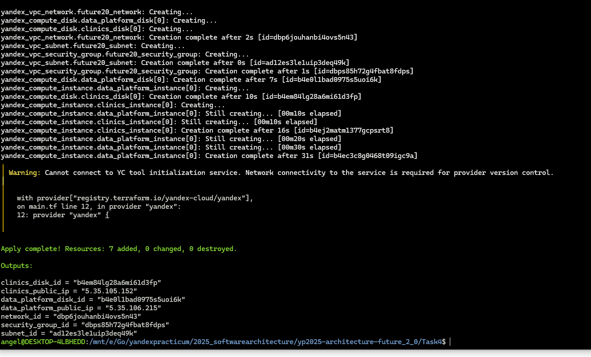
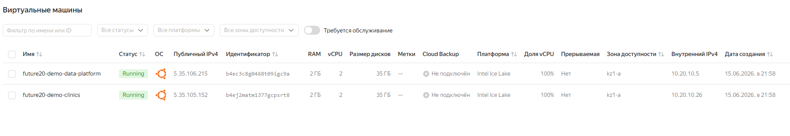

# Обоснование Terraform-конфигурации

## Цель инфраструктуры

Конфигурация описывает максимально простую IaaS-инфраструктуру для ранее выделенных доменов:

1. Домен ИИ
2. Домен аналитики (BI)
3. Домен отчетности (Портал самообслуживания)
4. Домен crm (работа с данными клиентов)
5. Домен медицинский (работа с медицинскими данными)
6. Домен финансов

Задача этой конфигурации - показать, как Terraform может воспроизводимо создать базовый инфраструктурный слой под 
независимое развитие доменов. 

В задании представлен вариант для пробной облачной среды, поэтому сеть и размеры ресурсов упрощены.

## Какие компоненты управляются Terraform

Terraform создает:

* одну VPC Network;
* одну subnet для всех доменных VM;
* одну общую security group;
* VM для включенных доменов;
* boot disk для каждой включенной VM;
* дополнительный persistent disk на 20 GB для каждой включенной доменной VM;
* outputs с IP-адресами VM и идентификаторами сети/подсети/диска.

Чтобы конфигурация проходила в пробной версии облака с небольшими квотами, домены можно включать и 
выключать через переменные `create_*`. По умолчанию создаются только `clinics` и `data-platform`: 
этого достаточно, чтобы показать операционный домен и домен платформы данных, не создавая сразу шесть VM — не влезем
в квоту бесплатного периода

## Какие компоненты разворачиваются вручную или отдельным пайплайном

Вручную или отдельными средствами разворачиваются:

* DNS и TLS для портала;
* секреты приложений;
* прикладные сервисы доменов;
* S3, каталог данных и BI-портал;
* миграционные пайплайны и загрузка данных;
* мониторинг, резервное копирование и SSO.

Terraform в этом задании отвечает только за IaaS-слой: сеть, VM, диски и базовые правила доступа.

В production-архитектуре домены можно развести по разным подсетям и security groups.

### Результат запуска

## Как IaC помогает бизнесу

IaC поддерживает цели «Будущего 2.0»:

* **ускорение вывода продуктов:** новые доменные среды создаются по шаблону;
* **снижение зависимости от DWH:** домены получают отдельные инфраструктурные контуры;
* **масштабирование:** можно добавлять новые домены или партнерские VM отдельными Terraform-ресурсами по тому же шаблону;
* **снижение затрат:** параметры VM и дисков заданы явно и могут быть уменьшены для пробного окружения;
* **воспроизводимость:** инфраструктура создается одинаково при повторном запуске.
